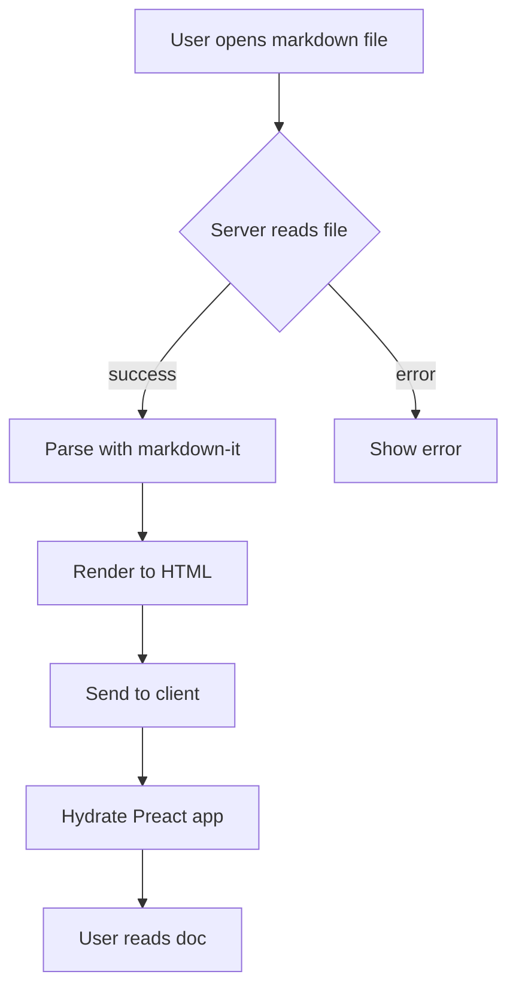

# mdview Feature Showcase

Welcome to the mdview kitchen-sink fixture. This single document exercises every
feature of the viewer so you can validate everything end-to-end without bouncing
between scratch files. Scroll slowly to watch the reading-progress bar fill, use
the outline to jump around, and try `Cmd+F` to verify in-document search.

## Table of contents

This intro section is intentionally medium-length so the reading-progress bar
has room to move and so scroll-spy has something to highlight before you reach
the deep headings further down.

---

## Heading levels

### Level 3 heading

This level should appear in the outline and the breadcrumb when in view.

#### Level 4 heading

Level 4 also appears in the outline and is useful for nested sections.

##### Level 5 heading

Level 5 is rendered but typically excluded from the outline; verify your
outline behavior matches expectations.

###### Level 6 heading

Level 6 is the deepest heading — confirm it renders with the right type scale.

---

## Inline text features

This paragraph contains **bold text**, *italic text*, ***bold italic***,
`inline code`, and ~~strikethrough~~ all in one place. The rendering should
remain readable and the inline `code` background should match the theme.

A second paragraph for spacing — use `Cmd+F` and search for the word
**rendering** to confirm the search counter shows the right count and that
hits are highlighted as you press Enter to step through them.

---

## Code blocks (six languages)

TypeScript:

```typescript
interface Greeter {
  name: string;
  greet(): string;
}

const hello: Greeter = {
  name: 'mdview',
  greet() {
    return `Hello from ${this.name}!`;
  },
};

console.log(hello.greet());
```

Python:

```python
def fib(n: int) -> int:
    a, b = 0, 1
    for _ in range(n):
        a, b = b, a + b
    return a

print([fib(i) for i in range(10)])
```

Go:

```go
package main

import "fmt"

func main() {
    nums := []int{1, 2, 3, 4, 5}
    sum := 0
    for _, n := range nums {
        sum += n
    }
    fmt.Println("sum:", sum)
}
```

JSON:

```json
{
  "name": "mdview",
  "version": "1.0.0",
  "features": ["search", "outline", "lightbox", "mermaid"],
  "themes": { "light": true, "dark": true }
}
```

Bash:

```bash
#!/usr/bin/env bash
set -euo pipefail
for f in *.md; do
  echo "rendering $f"
  mdview "$f" --no-open
done
```

SQL:

```sql
SELECT u.id, u.name, COUNT(p.id) AS post_count
FROM users u
LEFT JOIN posts p ON p.author_id = u.id
WHERE u.created_at >= '2026-01-01'
GROUP BY u.id, u.name
ORDER BY post_count DESC
LIMIT 10;
```

Each block above should have a working copy button and dual-theme syntax
highlighting via Shiki.

---

## Mermaid diagram



The diagram should render visually, not as raw code.

---

## Tables

| Feature        | Status   | Notes                                |
| -------------- | -------- | ------------------------------------ |
| Outline        | working  | Scroll-spy highlights current item   |
| Search         | working  | Counter now uses signals             |
| Lightbox       | working  | Click any image, Esc closes          |
| Reading time   | working  | Computed from word count             |
| Breadcrumbs    | working  | Updates as you scroll                |
| Mermaid        | working  | Renders code-fenced `mermaid` blocks |

Hover over a row to confirm the hover highlight is visible in both themes.

---

## Blockquotes

> A single-line blockquote for the simple case.

> An outer blockquote.
>
> > A nested blockquote inside the outer one — verify left-border indentation
> > stacks correctly and remains readable.
>
> Back to the outer level for the closing line.

---

## Task lists

- [x] Render checkboxes only for `[ ]` / `[x]` items
- [x] Leave normal bullets alone
- [ ] Make checkboxes interactive (out of scope)
- [ ] Sync state to disk (out of scope)

The checkboxes should be visually present but disabled.

---

## Lists with nesting

Unordered:

- First-level item
  - Nested item A
  - Nested item B
    - Deeply nested item
- Another first-level item

Ordered:

1. Step one
2. Step two
   1. Sub-step
   2. Another sub-step
3. Step three

---

## Horizontal rule

Above this paragraph and below it are horizontal rules. They should render as
plain horizontal lines — no decorative dingbats, glyphs, or fancy SVG ornaments.

---

## Images

A wave (relative path):


A star (relative path):


Click either image. The lightbox should open. Press Esc to close it.

---

## Links

- Internal markdown link: [See linked doc](./linked-doc.md)
- Anchor link inside this page: [Jump to Mermaid section](#mermaid-diagram)
- External link: [Vercel](https://vercel.com)

The external link should display the `↗` indicator and open in a new tab.

---

## Inline HTML

<details>
<summary>Click to expand</summary>

This content is inside a native HTML `<details>` block. The viewer should not
strip it. Closing the disclosure should hide this paragraph again.

</details>

---

## A long stretch of prose

The following ~500 words exist to give the reading-progress bar, word count,
and reading-time estimate something real to work with. If your viewer reports
the document is roughly 800–1000 words long with a 4–5 minute reading time,
the math is wired up correctly.

Lorem ipsum dolor sit amet, consectetur adipiscing elit. Vivamus in ligula sit
amet ipsum mattis vehicula. Curabitur fermentum, sapien quis dictum tincidunt,
nulla ipsum hendrerit elit, nec scelerisque nulla erat at lectus. Nullam
dignissim, sem at ullamcorper varius, justo nibh tristique velit, vitae
fringilla sapien turpis nec felis. Aliquam erat volutpat. Sed cursus turpis
non risus efficitur, vitae blandit lacus elementum. Quisque facilisis arcu
non sapien dictum, vel imperdiet leo lacinia.

Praesent porta, lacus sit amet bibendum varius, ipsum lacus volutpat magna,
vitae aliquet nibh nulla in arcu. Donec sit amet erat in dolor convallis
gravida. Ut at justo ut massa egestas convallis. Etiam vitae libero a sapien
faucibus convallis. Cras mollis, neque sed cursus tristique, urna nibh
dignissim ipsum, in sodales lectus mauris vel risus. Mauris convallis, leo
non bibendum sodales, neque nisi blandit metus, nec consequat justo sapien
non risus. Phasellus iaculis, lectus id luctus pellentesque, justo lectus
porttitor velit, sed lobortis nibh ipsum non sapien.

Integer at risus ut nibh efficitur tincidunt. Vestibulum ante ipsum primis in
faucibus orci luctus et ultrices posuere cubilia curae; Suspendisse potenti.
Nullam vitae purus a augue tincidunt cursus. Sed nec sem id urna laoreet
finibus. Aenean accumsan velit non lectus efficitur, nec dictum lacus
malesuada. Pellentesque habitant morbi tristique senectus et netus et
malesuada fames ac turpis egestas. Mauris nec nisl ac justo dapibus
ullamcorper.

Curabitur eu efficitur eros. Aenean placerat orci nec arcu interdum, in
condimentum nibh elementum. Vivamus nec velit non magna fringilla efficitur.
In hac habitasse platea dictumst. Sed ultricies, lacus ac dictum tristique,
nulla nibh placerat ipsum, sit amet imperdiet velit nibh sit amet sapien.
Nullam tristique nec sapien at venenatis. Etiam vitae purus eget nibh
volutpat dignissim.

Sed dignissim, mauris a luctus dictum, justo nibh tincidunt nibh, nec
fringilla velit lectus eu sapien. Nullam sed efficitur lectus. Suspendisse
luctus, lacus eget porttitor pharetra, neque eros porta lectus, nec
sagittis turpis erat ac nisi. Aliquam erat volutpat. Mauris in nibh non
sapien finibus pharetra. Pellentesque eu sem nec ipsum scelerisque
fringilla. Donec rhoncus, dolor a luctus dictum, justo nibh tincidunt
ipsum, nec fringilla velit lectus eu sapien.

Vestibulum ante ipsum primis in faucibus orci luctus et ultrices posuere
cubilia curae; Suspendisse potenti. Nullam vitae purus a augue tincidunt
cursus. Sed nec sem id urna laoreet finibus. Aenean accumsan velit non
lectus efficitur, nec dictum lacus malesuada. End of long prose section.

---

## End

You reached the end of the showcase. If everything above looked right, the
viewer is healthy. Try [going to the linked doc](./linked-doc.md) and coming
back to verify in-app navigation preserves your sidebar and theme state.
